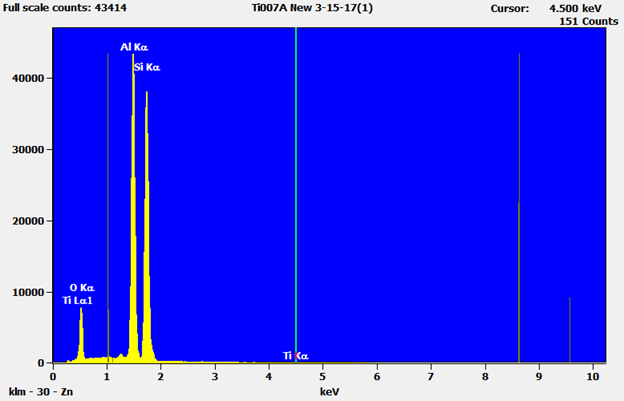
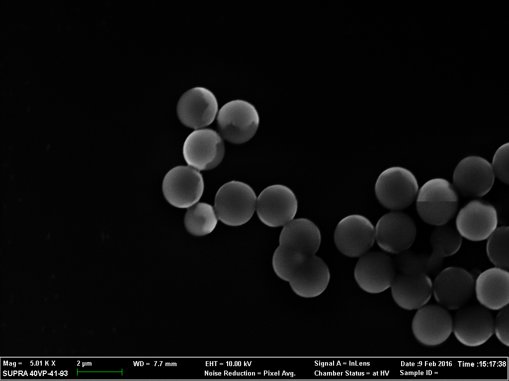
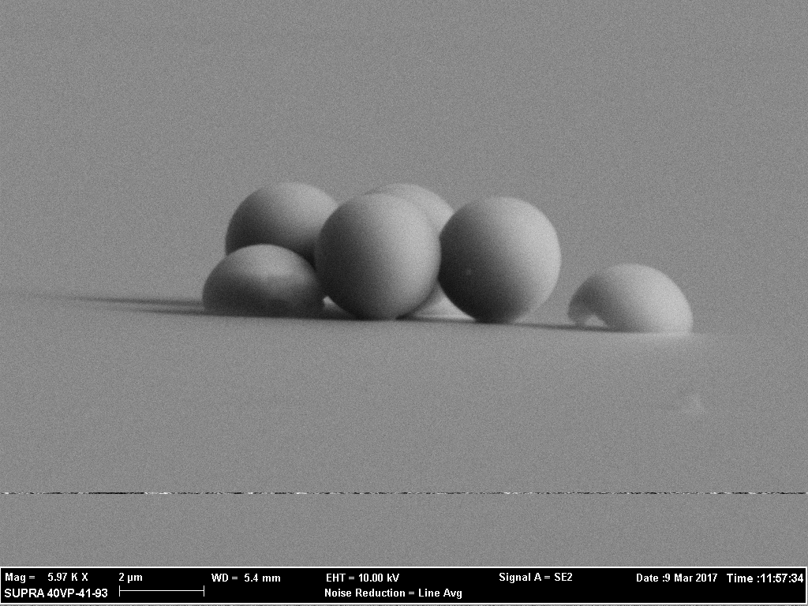
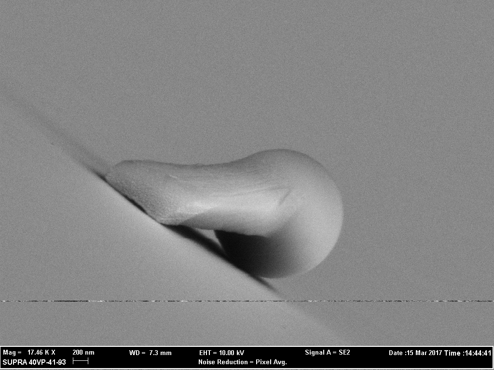

# Welcome to my Nanoscience Research Page

My experiments with Janus particles included the use of SEM (Scanning Electron Microscope) and EDS (Energy Dispersive X-Ray Spectroscopy). Using the beam of electrons to bounce off the surface of the particles helped us create images shown below. Knowing how the particles were structured was key to understanding their observational behavior. Along with the images, we used EDS to make sure the compounds of the particles were the desired result (since there could be contaminates). Elements I used (with combinations): Silicon, Oxygen, Titanium, Gold. The research I conducted are described below. The first one was when I was an undergraduate and the other was when I attended Graduate school.

## The Self-Assembly of Active Magnetic Micro- and Nano-structures
**Description:** 
The first study had to do with learning how to control the direction of the microparticles through the use of magnetic fields, generated by copper coils. And then have them self-assembly. It was a difficult task since these microparticles were swimming in water and hydrogen peroxide (reactive agent) and there were problems such as the liquid solution vaporating too quickly or the particles weren't correctly made. We got to work around some of the issues like being able to see them under a Scanning Electron Microscope (SEM) with the help of Energy Dispersive X-ray Spectroscopy. But trying to accurately pinpoint the speeds of these particles was a challenge that couldn't quite be solved, so some rounding had to be used. We used a camera and ImageJ to track the particles and then plugged the numbers into a spread sheet. There were some conversions between pixels to meters, and such. This research was based off of another project from another university, but we were able to find similarities between the two experiments, but we concluded that it wasn't the best delivery system.

The speeds of these self-propelling Janus particles are important to obtain to enable a comparison between different element compositions or particle geometry. These comparisons will determine the best propulsion system for optimal delivery. If these Janus particles are to be used for living organisms, they need to be not harmful to said organism. Not to mention knowing what the average speeds of these particles can scientifically predict if they can maneuver through a living body. Blood is being pumped with their own set of velocities, have their own viscosity, and the particles could be transported throughout the entire body. Or if these Janus particles are to be used for environmental use, they most likely need to be composed of elements that will not get absorbed into their surroundings or be sensitive to the UV exposure. Nonetheless, the need to control their direction(s) is a desired outcome.
UV light can turn the Janus particle’s motion on or off readily. Where they go is a little difficult to control since these Janus particles move randomly, called Brownian Motion. With the given equipment, the only way to semi-control the outcome is to change the geometric shape of the particle. The tail extended from the bead could influence which behavior these particles exhibit.

## Shape-Dependent Motion of Structured Photoactive Microswimmers
**Description:**
This time we focused on the geometery of the microparticles and used UV light as a reactive agent. It was more promising and potentially a safer delivery system than previous experiment. The end result actually was published through the Applied Materials & Interfaces journal.

[Shape-Dependent Motion of Structured Photoactive Microswimmers](https://pubs.acs.org/doi/10.1021/acsami.8b01940)

**Abstract:**
We investigate the dynamics of structured photoactive microswimmers and show that morphology sensitively determines the swimming behavior. Particular to this study, a major portion of the light-activated particles’ underlying structure is built from a photocatalytic material, made possible by dynamic physical vapor deposition (DPVD). We find that swimmers of this type exhibit unique shape-dependent autonomous swimming that is distinct from what is seem in systems with similar structural morphology but not fabricated directly from the catalyst. Notably, the direction of motion is a function of these parameters. Because the swimming behavior is strongly correlated with particle shape and material composition, DPVD allows for engineering small-scale propulsion by adjusting the fabrication parameters to match the desired performance.

Below are some pictures I gathered from my research:

